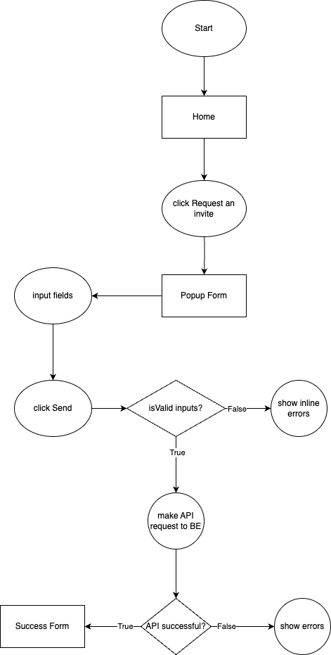
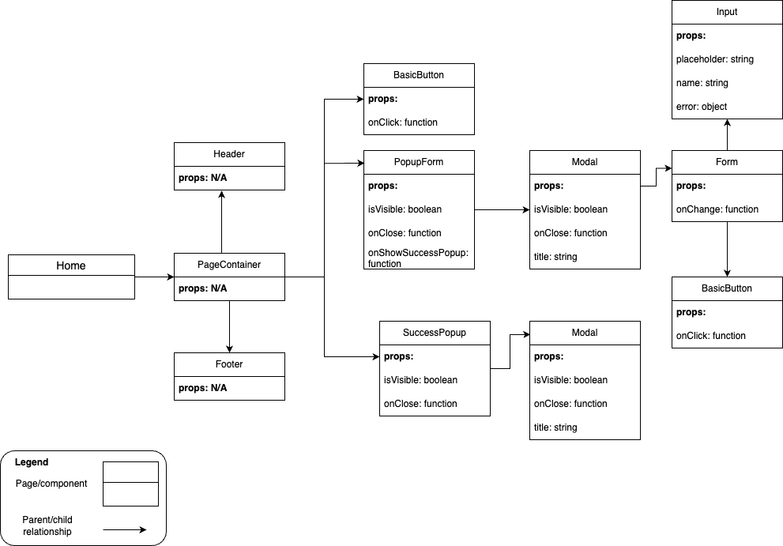

# Welcome to Simple SPA!

Please refer to this technical design for overall architecture and rationale behind the implementation

## Overview Architecture

### Rendering patterns

- SSR:

### Third-parties/frameworks usage

- React: the frontend library support me in writing user interfaces in break-down components and reuse them throught out the app. It helps keep code clean, modular, and easy to maintain

- React Router: handle routing in the case the app expands, support SSR, provide frameworks to quickly setup the project.

- Lodash: provide a collection of battle-tested utilities function, helps increase the efficency of coding

- Vite: a bundler that is fast, and easy to configure, support CSS modules

- Jest + React testing library: for unit tests

- State management: Since the project is quite simple and we don't have a lot of shared state, I've decided to not use any state management, kept the state local is sufficient

- UI libraries: Since the project is quite simple, I've decided to not using any UI libraries (antd, material UI)

- Package Manager: Since the project is quite simple, no need for other robust package managers

### Styling

- I decided to not using any css libraries/preprocessors since it requires no setup, and suitable for small projects like this despite some short commings (e.g: don't have mixins, limited in supporting reusable css code)

- I'm using CSS modules since it can limited the scope of CSS, separate the concerns among components

### Principles

- DRY: I've tried to maximize the reusability of code
- Separate of Concerns: I've broken down UIs into small components and reduce coupling among components. Also, i've separated UI and its logic
- CLEAN: I've broken down into 2 main layers (UI, services)

### Folder Structure

```
├── package.json
├── package-lock.json
├── app
    ├── assets/        # Static assets
    ├── components/    # Common components that likely to be reused
    ├── constants/     # Constants
    ├── services/      # API request functions
    ├── pages/         # Pages
    ├── typing/        # Typescript types
    ├── utils/         # Utility functions
├── docs               # Materials for the tech design
```

### Main flow



### Component Tree



## Detailed Designs

### Sequence Diagram


## Improvements

- Native CSS are limited in supporting reusable css code so considering to switch to more robust libraries such as SASS and Tailwind if project grows
- State management: introduce more robust state management solutions (redux, zustand,...) if needed
- UI libraries: introduce more robust UI libraries (antd, material UI,...) if needed
- Package Manager: introduce more robust such as PNPM to support monorepo if needed

## Run and Build

- Development:

```
npm i && npm run dev
```

website link: http://localhost:5173

- Build:

```
npm run build
```

- Serve

```
npm run start
```

website link: http://localhost:3000
